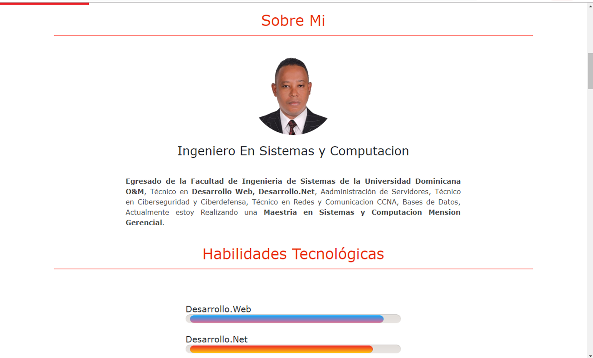
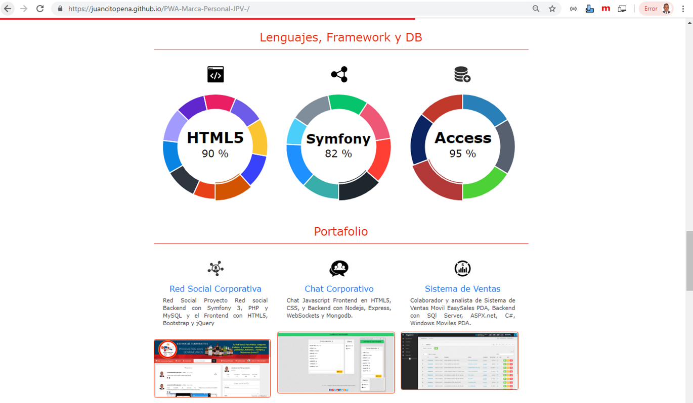
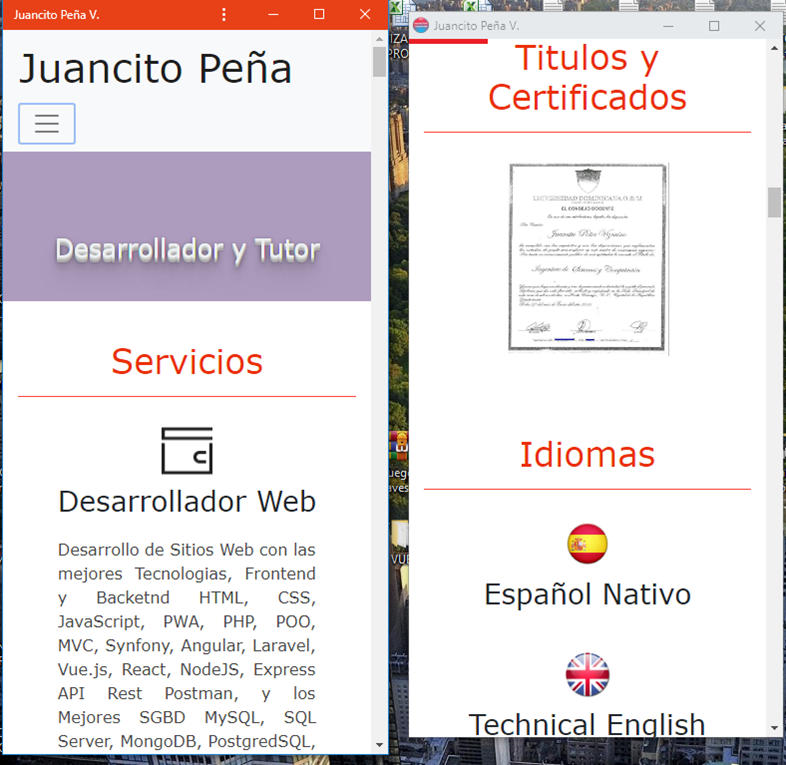

# PWA-Marca-Personal-JPV:
Desarrollo de Aplicaciones Web Progresivas (PWA) y sitios web Responsive y adaptables a cualquier móvil.

1-Maquetación web.
2-Responsive Design, para que tus webs se adapten perfectamente a la pantalla de cualquier dispositivo.
3-Desarrollo de PWA, usando JavaScript.
4-Github Pages, para publicar de forma gratuita nuestros sitios web en internet.
5-Angular PWA, para convertir cualquier proyecto con Angular a una aplicación web progresiva.

